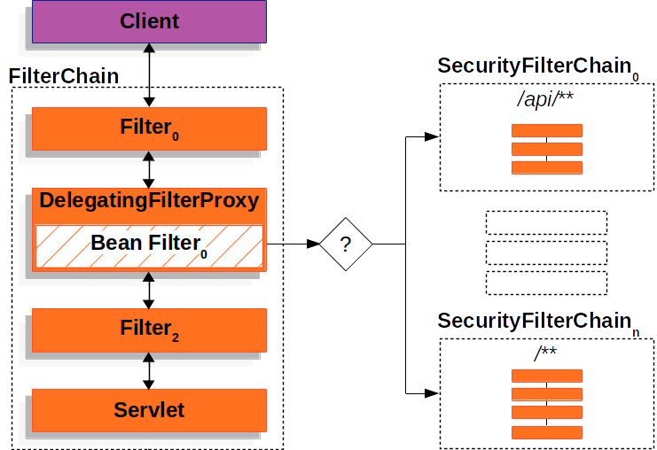
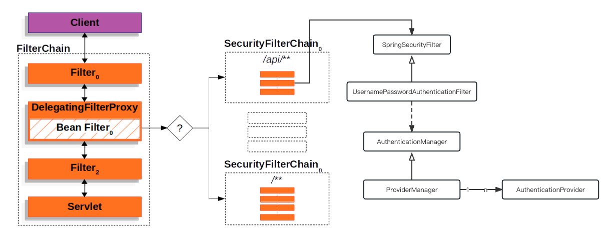

# Spring Security

本篇是`Spring Security`应用示例代码，包含了
1. 基础认证
2. 权限认证

### Quickly Start


## Spring Security 重要知识

### 1. Filter Chain Order

1. ChannelProcessingFilter, 由于可能需要重定向到不同的协议，所以使用此过滤器

2. SecurityContextPersistenceFilter, 在 Web 请求开始时设置 SecurityContextHolder 中的 SecurityContext，以及在 Web 请求结束时将 SecurityContext 的任何更改复制到 HttpSession 中（以便在下一个 Web 请求中使用）

3. ConcurrentSessionFilter, 更新 SessionRegistry

4. Authentication processing mechanisms 通过这些过滤器，可以通过修改 SecurityContextHolder 以包含有效的身份验证请求令牌
   - UsernamePasswordAuthenticationFilter 
   - CasAuthenticationFilter 
   - BasicAuthenticationFilter 
   - etc

5. The SecurityContextHolderAwareRequestFilter

6. RememberMeAuthenticationFilter, 通过设置Cookie，Authentication 对象将被放置在 SecurityContextHolder 中

7. AnonymousAuthenticationFilter, 可以理解为默认的 `Authentication processing mechanism`

8. ExceptionTranslationFilter, 捕获任何 `Spring Security` 异常，以便返回适当的 HTTP 错误响应或启动适当的 AuthenticationEntryPoint

9. FilterSecurityInterceptor, 保护 Web URI 并在访问被拒绝时引发异常

除了上面以外，Spring Security还定义了很多Filter，具体可以参考官网。
[Security Filters](https://docs.spring.io/spring-security/reference/servlet/architecture.html#servlet-security-filters)

同时 Spring Security 是通过Spring Boot Servlet的Filter过滤器实现安全和拦截功能的,
DelegatingFilterProxy --> FilterChainProxy 会负责注入`SecurityFilterChain`并处理对应的 Http Request从而实现安全和权限控制,
每个`SecurityFilterChain`都可以独立定义多个`SpringSecurityFilter`



### 2. 重要的类
- AuthenticationManager
从filter中获取认证信息，然后查找合适的AuthenticationProvider来发起认证流程

关键方法：

```java
Authentication authenticate(Authentication authentication) throws AuthenticationException;
```

- AuthenticationProvider
调用UserDetailsService来查询已经保存的用户信息并与从http请求中获取的认证信息比对。如果成功则返回，否则则抛出异常。

关键方法：

```java
protected abstract UserDetails retrieveUser(String username, UsernamePasswordAuthenticationToken authentication)
throws AuthenticationException;
```

- UserDetailsService
负责获取用户保存的认证信息，例如查询数据库。

关键方法：

```java
UserDetails loadUserByUsername(String username) throws UsernameNotFoundException;
```

### 系统架构图

